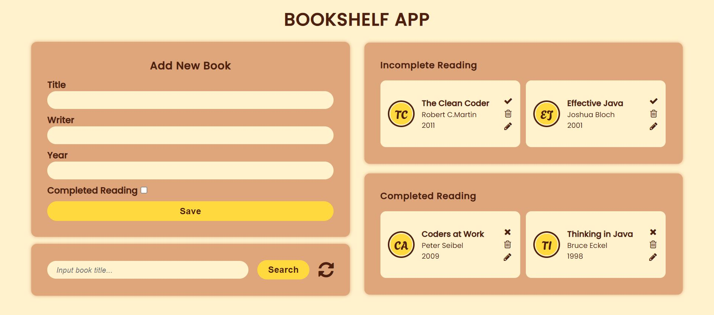

# Bookshelf App

# App Description

The "Bookshelf-App" is a simple application that allows users to store a list of books they have read or wish to read. This application is constructed using HTML, CSS, and JavaScript. Furthermore, it also employs Web Storage technology to preserve user data.

## Features

The "Bookshelf-App" has several key features:

1. **Add Books**: Users can add new books to their list. Each book has information such as title, author, and publication year.

2. **View Book List**: Users can view the list of books they've added to their bookshelf.

3. **Edit Books**: Users can edit the information of existing books in their list, such as modifying the title, author, or publication year.

4. **Toggle Completion Status**: Users can mark books as "complete" or "incomplete." This allows users to track books they've read or not.

5. **Remove Books**: Users can remove books from their list if they've finished reading them or want to delete them from the list.

6. **Web Storage**: Book data is stored in the browser's local storage using Web Storage, so the data remains available even after the user closes or refreshes the page.

## Technologies Used

The "Bookshelf-App" is built using various technologies, including:

- **HTML**: Used to build the web page structure.
- **CSS**: Used to style and layout the page.
- **JavaScript**: Used to add interactivity, manage book data, and interact with Web Storage.

## How to Use the App

1. Clone this repository or download the source code of the application.
2. Open the `index.html` file in your web browser.
3. You will see the "Bookshelf-App" interface.
4. You can add new books by clicking the "Add New Book" button.
5. Fill in book information and click "Save" to add it to your list.
6. You can view the list of books you've added and also edit, toggle completion status, or remove books as needed.

Copyright © 2023 [Azalya Rahmatika](azalyarahmatika.com)
